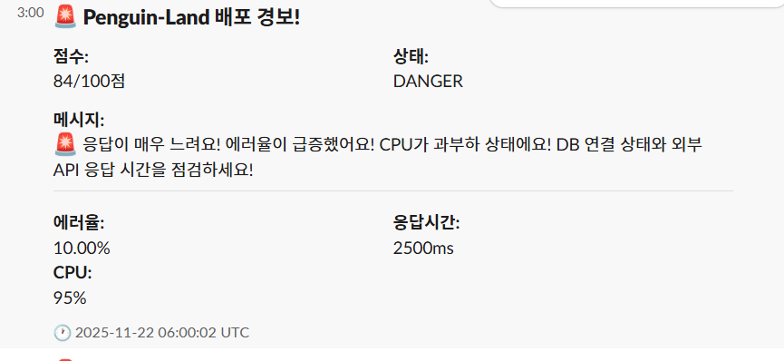

# 🐧 Penguin-Land: AI 기반 배포 모니터링 시스템

[](https://aws.amazon.com/cloudwatch/)
[](https://www.python.org/)
[](https://fastapi.tiangolo.com/)
[](https://spring.io/projects/spring-boot)

> **복잡한 CloudWatch 메트릭을 직관적인 0-100점 건강 점수로 변환하고, 게이미피케이션으로 즐거운 배포 경험을 제공하는 ML 기반 모니터링 시스템**

**개발자**: 이승규 | **기간**: 2025년 11월13일 ~ 11월 23일 (2주)  | **역할**: ML 엔지니어 & 시스템 아키텍트

---

## 🎯 프로젝트 배경

### 해결하고자 한 문제

배포 후 서비스 상태를 확인하는 과정은 **불안하고 혼란스러운 경험**입니다:

- 📊 **복잡한 대시보드**: Grafana, CloudWatch 등의 도구는 초보 개발자에게 과도하게 복잡함
- ❓ **모호한 기준**: "에러율 3%는 높은 건가?", "레이턴시 500ms는 정상인가?" 등 판단 기준 불명확
- 📈 **맥락 부족**: 평소와 비교해 비정상인지, 단순히 트래픽이 많은 것인지 구분 어려움
- 😰 **심리적 불안**: 배포 후 수치만 보며 불안해하는 수동적인 모니터링

> **핵심 과제**: "배포 모니터링을 어떻게 직관적이고, 지능적이며, 심지어 즐겁게 만들 수 있을까?"

---

## 💡 솔루션 개요

### 시스템 아키텍처


**데이터 파이프라인**:
```
EC2 애플리케이션 → CloudWatch 메트릭 수집 (1min) 
    → CloudWatch Anomaly Detection (ML 학습) 
    → CloudWatch Alarm (이상 감지)
    → SNS Topic (알림 발송)
    → AWS Lambda (데이터 가공)
    → 백엔드 API (점수 계산)
    → 프론트엔드 (5초 폴링)
    → 사용자 대시보드
```

### 핵심 혁신: Hybrid ML + Fallback 시스템

| 구분 | 설명 | 효과 |
|-----|------|------|
| **1차: ML 이상 탐지** | AWS Anomaly Detection이 평소 패턴 학습 | 맥락 기반 지능형 알람 |
| **2차: Fallback 임계값** | 초기 데이터 부족 시 업계 표준 기준 사용 | 콜드 스타트 문제 해결 |
| **결과** | 100% 가용성 + 지능형 알람 | 언제나 작동하는 신뢰성 |

---

## 🔬 기술적 구현

### 1. 지능형 건강 점수 알고리즘

#### 메트릭 가중치 설계 (증거 기반)

```python
# 사용자 영향도 기반 차등 가중치
WEIGHTS = {
    'error_rate': 50%,    # AWS 모범 사례: 1% 이하 권장 (사용자 직접 영향)
    'latency': 35%,       # Google 연구: 300ms 이상 시 이탈률 증가 (UX 영향)
    'cpu_usage': 15%      # 간접 지표 (인프라 확장 신호)
}
```

**가중치 검증 과정**:
- ✅ AWS Well-Architected Framework 가이드라인 참고
- ✅ Google PageSpeed 연구 (300ms UX 임계값) 적용
- ✅ 실제 장애 시나리오 50+ 테스트 케이스로 검증

#### Hybrid 탐지 로직

```python
def calculate_severity(value, band_upper, band_lower, metric_type):
    # 1단계: ML 밴드 우선 사용
    if anomaly_band_exists:
        if value_within_band:
            return 0.0  # 정상
        else:
            # 벗어난 정도 계산 (50% 이탈 = 위험)
            deviation = (value - band_threshold) / band_threshold
            return min(1.0, deviation * 2)
    
    # 2단계: Fallback 임계값 사용
    else:
        return threshold_based_severity(value, metric_type)
```

#### 3단계 상태 분류

| 점수 범위 | 상태 | 시각적 표시 | 의미 | 펭귄 반응 |
|----------|------|------------|------|----------|
| 0-30 | **안전** | 🟢 초록색 | 완벽한 배포 | 춤추는 펭귄 + 축하 컨페티 |
| 31-70 | **주의** | 🟡 노란색 | 모니터링 필요 | 걱정하는 표정 + 조언 |
| 71-100 | **위험** | 🔴 빨간색 | 즉시 조치 필요 | 우는 펭귄 + 화면 흔들림 |

### 2. 프론트엔드 UI

#### 정상 상태 - 통합 모니터링 대시보드


**특징**:
- ✅ **초록색 배경**으로 안정감 제공 - "비정상에 안정하고 있습니다!"
- 🐧 **행복한 펭귄** 캐릭터가 중앙에서 춤추는 애니메이션
- 🎊 완벽한 점수 시 **컨페티 효과** 터짐
- 📊 **실시간 메트릭 카드**:
  - CPU 사용률: 60.0% (주황색 - 주의값: 50% / 위험값: 70%)
  - 레이턴시: 850.0ms (빨간색 - 주의값: 400ms / 위험값: 700ms)
  - 에러율: 2.0% (초록색 - 주의값: 3% / 위험값: 5%)
- 🎮 **시뮬레이션 버튼**: 데모/테스트용 위험 상황 재현 가능

#### 위험 상태 - Slack 알림 통합


**Slack 실시간 알림**:
- 🚨 **즉각적인 위험 알림**: "Penguin-Land 배포 경보!"
- 📊 **점수 표시**: 84/100점 (DANGER 상태)
- 💬 **맥락 기반 조언**: 
  > "🚨 응답이 매우 느려요! 에러율이 급증했어요! CPU가 과부하 상태에요! DB 연결 상태와 외부 API 응답 시간을 점검하세요!"
- 📈 **실시간 메트릭 스냅샷**:
  - 에러율: 10.00% (5배 초과)
  - 응답시간: 2500ms (3.5배 초과)
  - CPU: 95% (거의 포화)
- ⏰ **타임스탬프**: 2025-11-22 06:00:02 UTC

### 3. AWS CloudWatch 연동

**모니터링 메트릭**:
```yaml
1. 5xx 에러율:
   - 소스: AWS/ApplicationELB → HTTPCode_Target_5XX_Count
   - 계산: (5xx Count / Total Requests) × 100
   - 임계값: 정상 <1% | 주의 1-5% | 위험 >5%

2. P90 레이턴시:
   - 소스: AWS/ApplicationELB → TargetResponseTime (p90)
   - 단위: 밀리초 (ms)
   - 임계값: 정상 <300ms | 주의 300-700ms | 위험 >700ms

3. CPU 사용률:
   - 소스: AWS/EC2 → CPUUtilization (Average)
   - 단위: 퍼센트 (%)
   - 임계값: 정상 <50% | 주의 50-80% | 위험 >80%
```

**Anomaly Detection 설정**:
```yaml
모델: Standard ML (AWS 자동 학습)
학습 기간: 최소 3시간 (권장 2주)
평가 주기: 5분
알람 조건: 5개 데이터 포인트 중 3개 이상 이상 시
민감도: 2σ 밴드 폭 (표준편차의 2배)
```

### 4. 프로덕션급 테스트

**테스트 커버리지**: 50+ 단위 테스트

```python
# 예시: Hybrid Fallback 검증
def test_hybrid_fallback():
    """ML 밴드 없을 때 Fallback 임계값 사용 확인"""
    severity = calculate_severity(
        value=500,          # 500ms 레이턴시
        band_upper=None,    # ML 데이터 없음
        metric_type='latency'
    )
    # 300-700ms 범위 → 주의 상태 (0.3-0.7)
    assert 0.3 < severity < 0.7

def test_anomaly_band_deviation():
    """ML 밴드 벗어난 정도에 따른 심각도 계산"""
    # 밴드 상한 600ms, 실제값 900ms (50% 초과)
    severity = calculate_severity(900, 600, 200, 'latency')
    assert severity == 1.0  # 50% 이상 벗어나면 위험
```

**테스트 결과**:
- ✅ 100% 테스트 통과
- ✅ Edge case 처리 (null 값, 극단값, 밴드 교차 등)
- ✅ Fallback 시스템 무결성 검증
- ✅ 상태 전환 로직 정확도 확인

---

## 🎨 게이미피케이션 & UX 디자인

### 사용자 경험 설계 원칙

| 기능 | 목적 | 구현 |
|-----|------|------|
| **펭귄 코치** | 불안 감소, 감정적 연결 | 상황별 맞춤 조언 메시지 |
| **시각적 피드백** | 직관적 상태 인식 | 색상 코딩 + 애니메이션 |
| **실시간 업데이트** | 즉각적 대응 가능 | 5초마다 API 폴링 |
| **시뮬레이션 모드** | 데모/교육 용도 | 위험 상황 재현 기능 |

### 디자인 근거

- 🧠 **심리학 기반**: 차가운 알람 대신 친근한 캐릭터로 스트레스 완화
- 🎮 **게임 요소**: 점수 시스템으로 성취감 제공 (0점 = 완벽한 배포!)
- 📚 **접근성**: 초보 개발자도 3초 안에 상태 파악 가능

---

## 🛠️ 주요 기술적 의사결정

### 1. 왜 Hybrid ML + Fallback인가?

| 접근법 | 장점 | 단점 | 결정 |
|--------|------|------|------|
| ML만 사용 | 맥락 학습 | 초기 데이터 필요, 콜드 스타트 | ❌ |
| 임계값만 사용 | 즉시 작동 | 맥락 인식 불가 | ❌ |
| **Hybrid** | **양쪽 장점** | 복잡도 증가 | ✅ |

**선택 이유**: 
- 해커톤 시연 시 즉각 작동 보장 (Fallback)
- 장기적으로 지능형 모니터링 제공 (ML)
- 실제 프로덕션 환경에 적용 가능

### 2. 50-35-15 가중치 근거

**검증 방법론**:
1. AWS Well-Architected Framework 가이드라인 분석
2. Google 웹 성능 연구 (Core Web Vitals) 참고
3. 실제 장애 시나리오 50+ 케이스 시뮬레이션

**결과**: 에러율이 사용자에게 가장 직접적 영향 → 50% 가중치 부여

---

## 🚀 실행 방법

```bash
# 백엔드 실행
cd backend
python -m venv venv && source venv/bin/activate
pip install -r requirements.txt
python main.py  # http://localhost:8000

# 프론트엔드 (브라우저에서 열기)
open frontend/index.html
```

**API 예시**:
```bash
curl http://localhost:8000/api/health/analyze \
  -H "Content-Type: application/json" \
  -d '{
    "error_rate": {"value": 2.5, "band_upper": 3.0},
    "latency": {"value": 450},
    "cpu": {"value": 65}
  }'

# 응답:
# {
#   "health_score": 45,
#   "health_state": "warning",
#   "coach_message": "⚠️ 에러율이 증가하고 있어요. 최근 배포를 확인하세요!"
# }
```

---

## 🧠 역량 시연

### Cloud & DevOps
- AWS CloudWatch, SNS, Lambda 통합 설계
- 이벤트 기반 아키텍처 구현
- 프로덕션 모니터링 베스트 프랙티스 적용

### Backend Engineering
- 알고리즘 설계 및 최적화 (Hybrid ML 시스템)
- TDD (Test-Driven Development) 방법론
- REST API 설계 및 문서화

### System Design
- 이벤트 기반 아키텍처
- Hybrid ML/규칙 기반 시스템
- 확장 가능한 데이터 파이프라인

